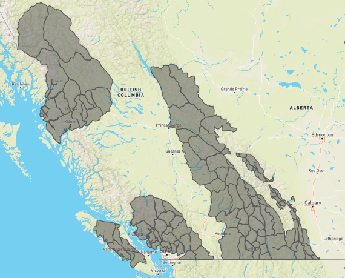

# Avalanche forecast subregions

## Overview

This repository stores the geospatial definitions for subregions used in Canadian public avalanche forecasts. Subregions are available in GeoJSON, KML, and ESRI shapefile formats, with the official master version stored in the root folder as `canadian_subregions.geojson`. Subsets for each agency are available in the `subsets` directory.

## Polygon properties

- `id`: universally unique identifier (UUID)
- `polygon_name`: subregion name
- `polygon_number`: integer
- `mountain_range`: Coast, Columbias, Rockies, East Coast
- `reference_region`: legacy forecast region
- `agency_name`: avalanche_canada, avalanche_quebec, kananaskis, parks_canada_byk, parks_canada_glacier, parks_canada_jasper, parks_canada_waterton
- `creation_date`: YYYY-mm-dd
- `last_updated`: YYYY-mm-dd

Note: shapefiles field names are truncated to ten characters and kml files use polygon_name as the Name attribute

## Editting instructions

Tools and instructions for editting subregions are provided in the [Guide for editting subregions](./editting_tools/readme.md). Copies of other file formats and subsets have been produced with `ogr2ogr` as shown in the script `editting_tools/conversions.sh`.